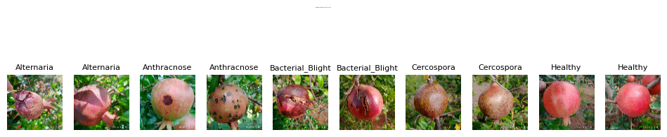
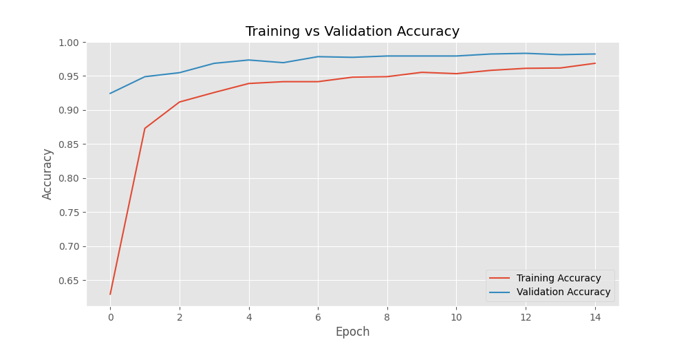
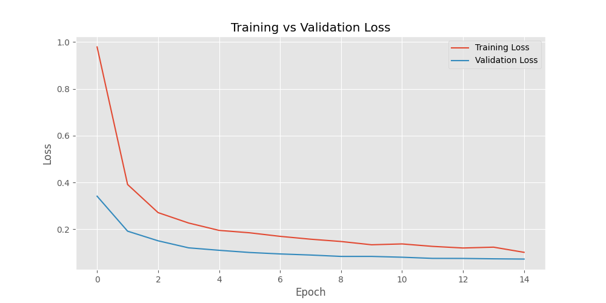
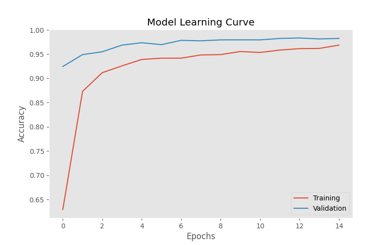
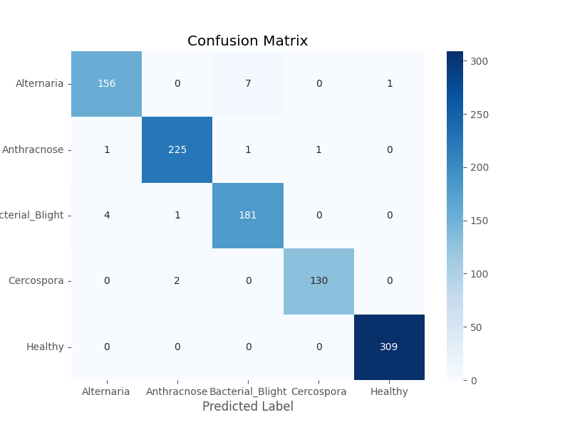

# Pomegranate Disease Detection Using MobileNetV2

Agriculture plays a vital role in the global economy, and fruit crops like Pomegranate (*Punica granatum*) are highly valued for their nutritional and economic benefits. However, pomegranate crops are highly susceptible to various fungal and bacterial diseases, which can significantly reduce yield and quality. Early and accurate detection of these leaf diseases is critical for timely agricultural intervention.

This project implements an end-to-end deep learning framework for the automated identification and classification of four major pomegranate leaf diseases—**Alternaria**, **Anthracnose**, **Bacterial Blight**, and **Cercospora**—alongside **Healthy** leaves. By leveraging a fine-tuned **MobileNetV2** architecture pre-trained on ImageNet, we construct a highly optimized, lightweight, and mobile-friendly classifier. The model achieves an outstanding **98.23% classification accuracy** on a validation dataset of 1,019 images.

---

## Dataset & Distribution
The training and validation dataset used for this project is the **[Pomegranate Fruit Diseases Dataset by Sujay Kapadnis](https://www.kaggle.com/datasets/sujaykapadnis/pomegranate-fruit-diseases-dataset)**. It consists of a total of **5,099 leaf images** distributed across 5 classes:

| Class Name | Disease/Status | Number of Images | Percentage |
| :--- | :--- | :--- | :--- |
| **Alternaria** | Fungal leaf spot disease | 886 | 17.38% |
| **Anthracnose** | Fungal rot and lesion disease | 1,166 | 22.87% |
| **Bacterial Blight** | Bacterial blight spots (black lesions) | 966 | 18.94% |
| **Cercospora** | Fungal leaf spot disease | 631 | 12.37% |
| **Healthy** | Disease-free foliage | 1,450 | 28.44% |
| **Total** | | **5,099** | **100.0%** |

### Visual Samples
To illustrate the visual characteristics of each leaf condition, a representative sample image from each class (Figure 1) and a grid showing two samples per class (Figure 2) are provided below:

*Figure 1: Representative Leaf Image for Each Class*


*Figure 2: Leaf Spot Details (Two Samples Per Class)*


---

## Model Architecture
Due to the prospective use-case in mobile agricultural applications, **MobileNetV2** was selected as the base feature extractor. Its depthwise separable convolutions drastically reduce computational complexity (parameters and FLOPs) while preserving high accuracy.

The classification system is structured as follows:
1. **Input Layer**: Accepts RGB images resized to **$224 \times 224 \times 3$**.
2. **Data Augmentation Stage**: Applied to the training set to prevent overfitting:
   - Random Rotation (factor = 0.2)
   - Random Zoom (factor = 0.2)
   - Random Horizontal Flip
3. **Preprocessing**: Normalizes pixel values dynamically according to ImageNet statistics (using `preprocess_input` from `tf.keras.applications.mobilenet_v2`).
4. **Base Feature Extractor**: MobileNetV2 (ImageNet weights, top layer excluded). The base layers are **frozen** (`trainable = False`) to keep the learned feature maps intact.
5. **Global Average Pooling**: Reduces the spatial dimensions ($7 \times 7 \times 1280$) to a 1D feature vector ($1280$).
6. **Classification Head**:
   - First Dropout Layer (30% drop rate) to prevent co-adaptation of features.
   - Fully Connected (Dense) Layer with **128 units** and ReLU activation.
   - Second Dropout Layer (30% drop rate).
   - Softmax Output Layer with **5 units** corresponding to the disease categories.

---

## Training and Hyperparameters
- **Data Splitting**: 80% Training (4,080 images) and 20% Validation (1,019 images).
- **Batch Size**: 32
- **Optimizer**: Adam ($\text{Learning Rate} = 10^{-4}$)
- **Loss Function**: Categorical Cross-Entropy (one-hot encoded labels)
- **Epochs**: 15 epochs
- **Callbacks**:
  - **Early Stopping**: Monitored `val_loss` with a patience of 5 epochs, restoring the best weights.
  - **Model Checkpoint**: Monitored `val_accuracy` to save only the best Keras model file (`best_mobilenet_pomegranate.keras`).

---

## Experimental Results and Performance Evaluation

### 1. Quantitative Analysis
The model demonstrates exceptional performance, obtaining a final validation accuracy of **98.23%** and validation loss of **0.0726** in 15 epochs. 

A detailed evaluation is given in the classification report below:

| Class Name | Precision | Recall | F1-Score | Support |
| :--- | :---: | :---: | :---: | :---: |
| **Alternaria** | 0.97 | 0.95 | 0.96 | 164 |
| **Anthracnose** | 0.99 | 0.99 | 0.99 | 228 |
| **Bacterial Blight** | 0.96 | 0.97 | 0.97 | 186 |
| **Cercospora** | 0.99 | 0.98 | 0.99 | 132 |
| **Healthy** | 1.00 | 1.00 | 1.00 | 309 |
| **Accuracy** | | | **0.98** | **1019** |
| **Macro Avg** | 0.98 | 0.98 | 0.98 | 1019 |
| **Weighted Avg** | 0.98 | 0.98 | 0.98 | 1019 |

### 2. Learning Curves
The training history illustrates that the validation accuracy and loss converge smoothly towards the training metrics, indicating that the regularization methods (Dropout and Data Augmentation) successfully controlled overfitting.

*Figure 3: Learning Curve - Training vs. Validation Accuracy*


*Figure 4: Learning Curve - Training vs. Validation Loss*


*Figure 5: Model Learning Curve*


### 3. Confusion Matrix
The confusion matrix heatmap illustrates the high classification accuracy of the model, showing very few misclassifications between categories. Most classes have perfect or near-perfect predictions.

*Figure 6: Confusion Matrix Heatmap*


---

## Usage and Inference
The model can be used to run predictions on leaf images using the prediction notebook [predict.ipynb](predict.ipynb) or python scripts.

1. **Load Model & Preprocess**:
   ```python
   import tensorflow as tf
   import cv2
   import numpy as np

   model = tf.keras.models.load_model('best_mobilenet_pomegranate.keras')

   def preprocess_image(img_path):
       img = cv2.imread(img_path)
       img = cv2.resize(img, (224, 224))
       img = cv2.cvtColor(img, cv2.COLOR_BGR2RGB)
       img = np.expand_dims(img, axis=0)
       img = tf.keras.applications.mobilenet_v2.preprocess_input(img)
       return img
   ```

2. **Inference**:
   ```python
   class_names = ["Alternaria", "Anthracnose", "Bacterial Blight", "Cercospora", "Healthy"]
   img_processed = preprocess_image('path_to_leaf_image.jpg')
   preds = model.predict(img_processed)
   class_index = np.argmax(preds[0])
   confidence = np.max(preds[0])
   print(f"Predicted Disease: {class_names[class_index]} ({confidence*100:.2f}%)")
   ```
